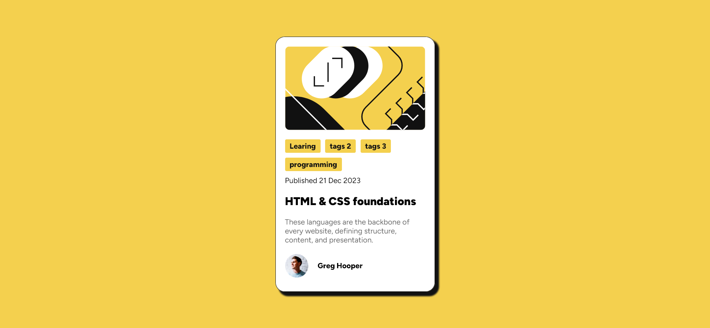
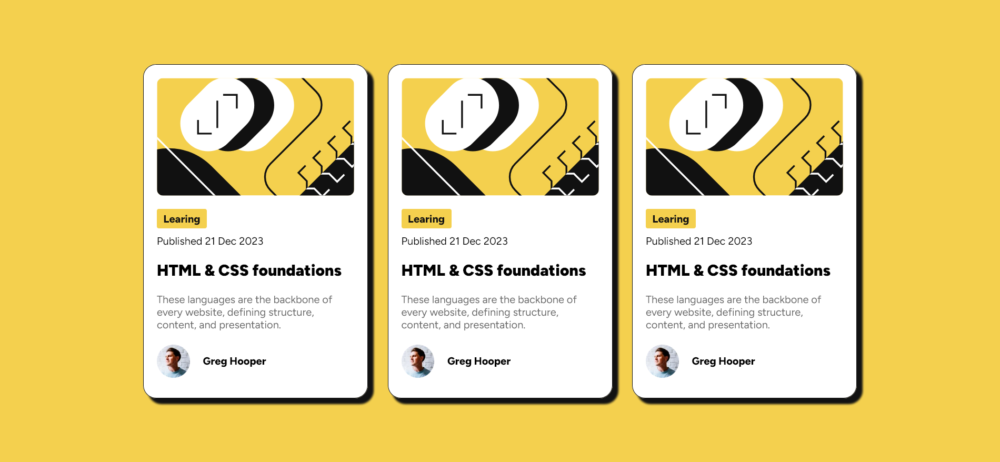

# Frontend Mentor - Blog preview card solution

This is a solution to the [Blog preview card challenge on Frontend Mentor](https://www.frontendmentor.io/challenges/blog-preview-card-ckPaj01IcS). Frontend Mentor challenges help you improve your coding skills by building realistic projects. 

## Table of Contents
- [Overview](#overview)
    - [The challange](#the-challange)
    - [Screenshoots](#screenshots)
    - [Links](#links)
- [My Process](#my-process)
## Overview

### The challenge

Users should be able to:

- See hover and focus states for all interactive elements on the page

I also add my little challange the goal is to :

- Displaying multiple tags in row order and the background size is following word length
- Making reusable CSS component
- Organizing color using custom CSS Properties 

### Screenshots

### Links

- Solution URL: [Add solution URL here](https://your-solution-url.com)
- Live Site URL: [Add live site URL here](https://your-live-site-url.com)

## My Process

### Build With 
- CSS custom properties
- Fexbox

